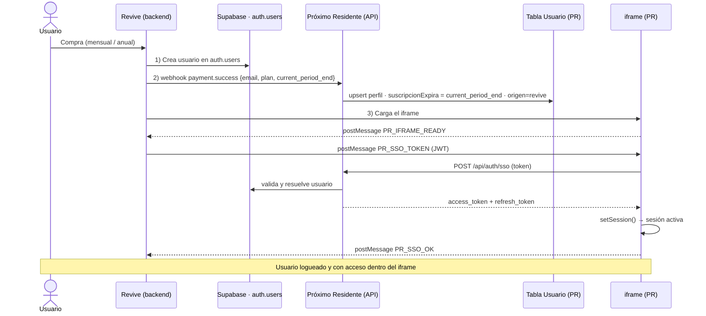

# Integración Revive ↔ Próximo Residente — Guía de implementación

Hola 👋. Este documento resume lo acordado para embeber **Próximo Residente** dentro de un iframe en **Revive**, con login automático (SSO) y sincronización de la suscripción. Incluye:

1. **Lo que necesitamos de ti para avanzar** (3 cosas, nos desbloquean).
2. **Lo que debes integrar de tu lado** (token SSO, iframe, postMessage, webhook).
3. **Lo que hacemos nosotros** (para que tengas el panorama completo).

- **App embebida:** `https://proximoresidente.com` (Next.js + Supabase)
- **Dominio que embebe:** `https://revivevirtual.com`
- **Enfoque de auth:** SSO por **token de un solo uso** (no usamos cookies de terceros).

---

## 1. Lo que necesitamos de ti para avanzar 🚧

Sin esto no podemos terminar nuestras Fases 2 y 3:

1. **Secreto compartido (`SSO_SHARED_SECRET`)** — una clave para firmar tanto el token SSO como el webhook. Compártela por un **canal seguro** (gestor de contraseñas compartido), nunca por chat/correo.
2. **Confirmar el origin** — ¿el iframe carga solo desde `https://revivevirtual.com`, o también desde `https://www.revivevirtual.com`?

> **Nota sobre vencimiento:** sin período de gracia. El acceso se corta exactamente al llegar `current_period_end` (o ante cancelación/impago). Por eso es importante que `current_period_end` refleje la fecha real hasta la que el usuario pagó.

---

## 2. Lo que debes integrar de tu lado ⚙️

Hay dos integraciones independientes: **(A) login por SSO** y **(B) sincronización de suscripción por webhook**.

### A. Login automático (SSO en el iframe)

#### A.1 — Generar el token (en tu backend)

**JWT firmado con HS256** usando `SSO_SHARED_SECRET`. Vida muy corta y de un solo uso.

| Claim | Obligatorio | Valor |
|-------|-------------|-------|
| `iss` | sí | `"revive"` |
| `aud` | sí | `"proximoresidente"` |
| `email` | sí | email del usuario (llave que enlaza la cuenta) |
| `sub` | sí | id del usuario en Revive |
| `name` | opcional | nombre del usuario |
| `iat` | sí | timestamp de emisión |
| `exp` | sí | `iat + 90` (segundos) |
| `jti` | sí | UUID único (anti-replay, un solo uso) |

Ejemplo de payload:
```json
{
  "iss": "revive",
  "aud": "proximoresidente",
  "email": "usuario@correo.com",
  "sub": "revive_user_12345",
  "name": "Juan Pérez",
  "iat": 1750800000,
  "exp": 1750800090,
  "jti": "b3f1c2a4-9d8e-4f12-a1b2-c3d4e5f6a7b8"
}
```
> El token se genera **en el backend** (donde vive el secreto), nunca en el navegador.

#### A.2 — Embeber el iframe

> ⚠️ **Usa `https://www.proximoresidente.com` (con `www`) en TODOS lados.** El apex
> `proximoresidente.com` hace un **308 redirect a `www`**, así que el documento real
> dentro del iframe tiene origin `https://www.proximoresidente.com`. Si embebes el apex,
> el `PR_IFRAME_READY` te llegará con origin `www` (tu filtro lo descartará) y el
> `PR_SSO_TOKEN` que mandes con `targetOrigin` apex **no se entregará** (el navegador lo
> bloquea por no coincidir el origin). Embebe directamente `www` para evitar el redirect.

```html
<iframe
  src="https://www.proximoresidente.com"
  allow="fullscreen"
  style="width:100%; height:100%; border:0;">
</iframe>
```

#### A.3 — Enviar el token por `postMessage`

```js
// OJO: el origin es CON www (ahí queda el iframe tras el redirect del apex).
const PR_ORIGIN = "https://www.proximoresidente.com";

window.addEventListener("message", (event) => {
  // Aceptar mensajes SOLO desde nuestro dominio:
  if (event.origin !== PR_ORIGIN) return;

  // 1) Nuestro iframe avisa que cargó:
  if (event.data?.type === "PR_IFRAME_READY") {
    // 2) Le envías el token (SIEMPRE con targetOrigin explícito):
    iframeEl.contentWindow.postMessage(
      { type: "PR_SSO_TOKEN", token: jwtGeneradoEnElBackend },
      PR_ORIGIN
    );
  }

  // 3) Confirmaciones de resultado:
  if (event.data?.type === "PR_SSO_OK")    { /* sesión iniciada */ }
  if (event.data?.type === "PR_SSO_ERROR") { console.error("SSO:", event.data.error); }
});
```

> Nota: registra este listener **antes** de pedir el token a tu backend (o guarda el
> token en una variable y deja el listener montado desde el inicio). Nuestro iframe
> reemite `PR_IFRAME_READY` cada 0.5s durante ~12s, así que aunque tu listener tarde un
> poco en montarse alcanzará a recibir un READY; pero lo robusto es escuchar desde ya.

### B. Sincronización de suscripción (webhook)

El login (SSO) solo da **identidad**. El **acceso** (activo/inactivo cada mes o año) se sincroniza por webhook.

#### B.1 — Reparto de responsabilidades sobre el usuario

- **`auth.users` (Supabase):** lo creas **tú** al cerrar la venta (ya tienes acceso a Supabase).
- **Perfil de aplicación (`Usuario`):** lo crea/sincroniza **nuestro webhook**. **No toques esa tabla**, así quedas desacoplado de nuestro esquema.

#### B.2 — Webhook a enviar — `POST https://proximoresidente.com/api/webhooks/revive`

Dispáralo en cada evento de facturación: **cobro exitoso (alta/renovación), cobro fallido y cancelación.**

| Campo | Obligatorio | Descripción |
|-------|-------------|-------------|
| `event` | sí | `payment.success` / `payment.failed` / `subscription.cancelled` |
| `email` | sí | email del usuario (debe coincidir con el de `auth.users`) |
| `subscription_id` | sí | id de la suscripción en Revive |
| `plan` | en `payment.success` | `"monthly"` o `"annual"` |
| `current_period_end` | en `payment.success` | **fecha hasta la que el usuario tiene acceso pagado** (ISO 8601) |
| `event_id` | sí | id único del evento (idempotencia) |

Ejemplo:
```json
{
  "event": "payment.success",
  "email": "usuario@correo.com",
  "subscription_id": "rev_sub_98765",
  "plan": "annual",
  "current_period_end": "2027-06-24T00:00:00Z",
  "event_id": "evt_0a1b2c3d"
}
```

Requisitos:
- **Firmado** con `SSO_SHARED_SECRET` (HMAC SHA-256). Te pasamos el detalle de la cabecera de firma al integrar.
- **Idempotente**: reintentos del mismo `event_id` no deben contar doble.
- Envía directamente `current_period_end` (la fecha de vencimiento real). Así funciona igual para mensual, anual o cualquier plan futuro — nosotros solo guardamos esa fecha.

> ⚠️ **Aclaración importante:** `current_period_end` **no es una columna de Supabase**, no lo busques ahí. Es un dato que **tu sistema de cobros ya tiene** (la fecha "pagado hasta") y que solo debes **incluir en el cuerpo del webhook**. Tu pasarela de pago suele entregarlo con ese nombre o equivalente (p. ej. Stripe: `current_period_end`; MercadoPago: `next_payment_date` dentro de la suscripción). Nosotros recibimos ese valor y lo guardamos en nuestra columna `suscripcionExpira` (tabla `Usuario`) — tú no tocas esa tabla.

---

## 3. Lo que hacemos nosotros (Próximo Residente) ✅

- **Iframe:** autorizamos `revivevirtual.com` vía `Content-Security-Policy: frame-ancestors` (sin `X-Frame-Options`, sobre HTTPS). **Ya implementado** en un entorno de prueba (Preview).
- **SSO:** endpoint `POST /api/auth/sso` que valida tu token (firma, `aud`, `exp`, `jti` un solo uso), resuelve al usuario y crea su sesión de Supabase dentro del iframe. Si el email no existe, devolvemos error (no creamos usuarios; eso lo haces tú).
- **Webhook:** endpoint `/api/webhooks/revive` que valida la firma, hace `upsert` del perfil del usuario y fija su acceso (`current_period_end`). Si vence la fecha, el acceso se corta solo.

---

## 4. Flujo completo

```
1. Usuario compra en Revive (mensual o anual)
2. Revive crea el usuario en auth.users (Supabase)
3. Revive dispara webhook payment.success → nuestro endpoint crea el perfil
   con acceso hasta current_period_end
4. Revive carga el iframe de proximoresidente.com
5. iframe → "PR_IFRAME_READY"
6. Revive → "PR_SSO_TOKEN" (JWT)
7. iframe valida el token con nuestro backend y crea la sesión
8. Usuario queda logueado y con acceso, dentro del iframe ✅

Cada mes/año:
- Cobro OK  → webhook → se extiende current_period_end → sigue activo
- Impago    → webhook → no se extiende → al vencer, acceso cortado (sin gracia, automático)
```

### Diagrama de responsabilidades (quién escribe qué y dónde)

> Regla de oro: **Revive solo escribe en `auth.users` y envía webhooks. Nunca toca la tabla `Usuario`.** Próximo Residente es el dueño de la suscripción/acceso.

```
   REVIVE (revivevirtual.com)                 PRÓXIMO RESIDENTE (proximoresidente.com)
   ───────────────────────────               ─────────────────────────────────────────

   [Sistema de cobros]
        │
        │ 1) crea el usuario
        ▼
   ┌──────────────────────┐
   │ Supabase · auth.users│ ◄──── (login: PR lee de aquí al iniciar sesión)
   └──────────────────────┘
        │
        │ 2) webhook payment.success
        │    { email, plan, current_period_end }
        ▼
                                          ┌────────────────────────────┐
                                          │  POST /api/webhooks/revive  │
                                          └────────────────────────────┘
                                                       │ escribe
                                                       ▼
                                          ┌────────────────────────────┐
                                          │  Tabla Usuario (de PR)      │
                                          │  · suscripcionExpira        │
                                          │  · suscripcionOrigen=revive │
                                          │  · suscripcionStatus        │
                                          └────────────────────────────┘

        │ 3) carga el iframe + token SSO (postMessage)
        ▼
                                          ┌────────────────────────────┐
                                          │  POST /api/auth/sso         │
                                          │  valida token → crea sesión │
                                          └────────────────────────────┘

   ESCRIBE Revive:  Supabase auth.users
   ESCRIBE PR:      Tabla Usuario (suscripción/acceso) + sesión del iframe
```

Y el flujo en el tiempo (se ve gráfico en GitHub):



---

## 5. Checklist de implementación (lado Revive)

- [ ] Acordar y compartir `SSO_SHARED_SECRET` por canal seguro
- [ ] Confirmar origin (`revivevirtual.com` y/o `www.`)
- [ ] Generar el token JWT (HS256, claims y expiración indicados)
- [ ] Embeber el iframe con `allow="fullscreen"`
- [ ] Implementar el handshake `postMessage` (READY → TOKEN → OK/ERROR)
- [ ] Crear el usuario en `auth.users` al cerrar la venta
- [ ] Disparar el webhook en cobro exitoso, fallido y cancelación (firmado e idempotente)

---

## 6. Seguridad (ambos lados)

- Token SSO de **vida corta** (90s) y **un solo uso** (`jti`).
- Validación estricta de `origin` en `postMessage` (ambos sentidos).
- `targetOrigin` siempre explícito (nunca `"*"`).
- El secreto **nunca** viaja al navegador ni por canales inseguros.
- Webhook firmado (HMAC) e idempotente.
- Todo sobre HTTPS.

---

Cualquier duda sobre el formato del token, el handshake o el webhook, quedamos atentos para alinearlo. En cuanto nos pasen el secreto compartido y confirmen los dos puntos pendientes, terminamos nuestra parte (SSO + webhook).
